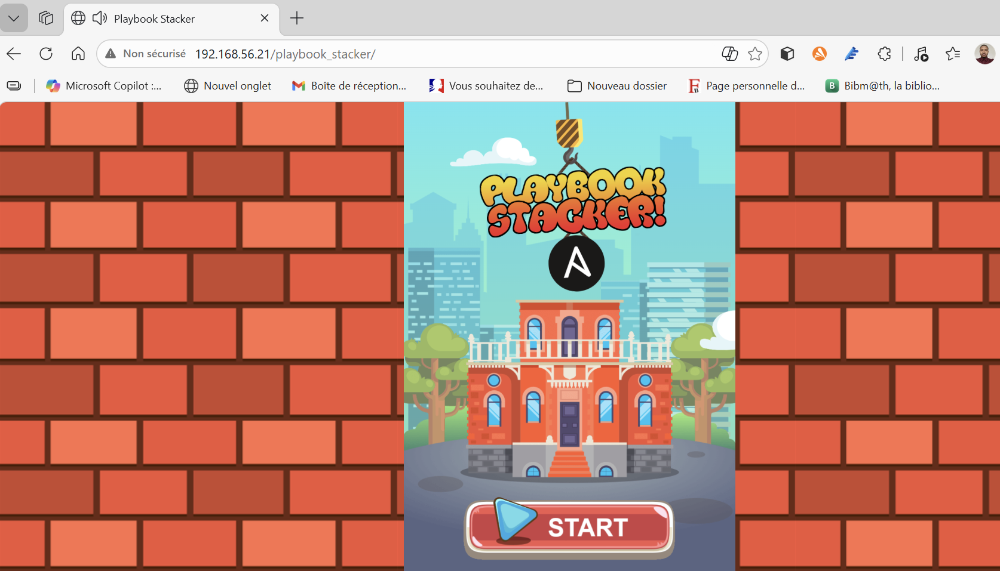
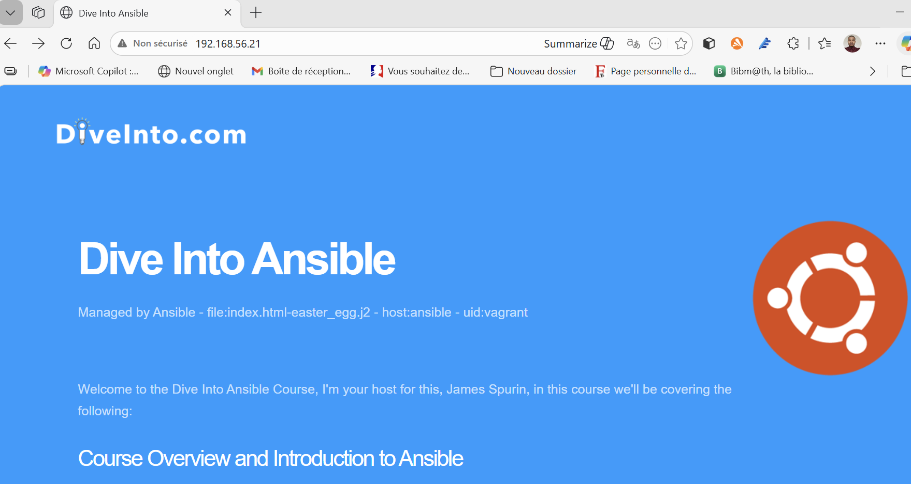
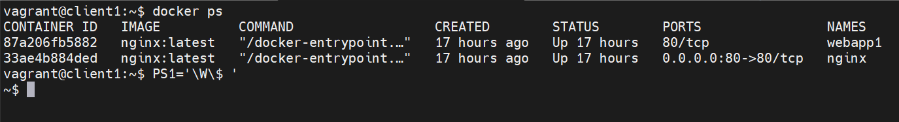
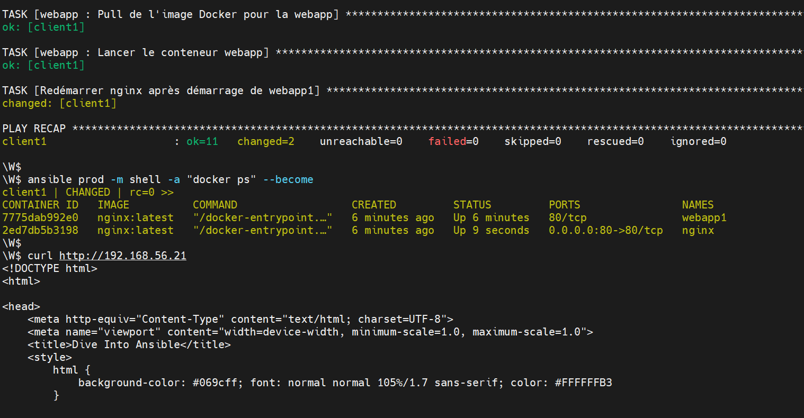
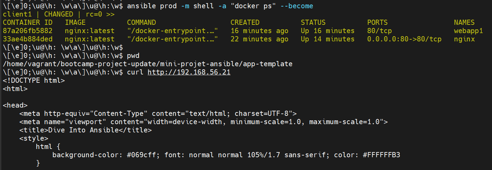

# Mini-Projet Ansible — Déploiement d'une Application Web
> **Auteur :** Alpha 
> **Environnement :** Vagrant + VirtualBox  
> **Outils :** Ansible 2.17, Docker 28/29, Nginx
---
## 🗺️ Architecture Globale

```
Machine Hôte (PC)
│
├── VM ansible (192.168.56.20)   ← Contrôleur Ansible
│     ├── Ansible 2.17
│     └── Docker 29.3.0
│
├── VM client1 (192.168.56.21)   ← Serveur PROD (cible des déploiements)
│     └── Docker 28.2.2
│
└── VM client2 (192.168.56.22)   ← Serveur STAGING (non utilisé dans ce projet)
```
> ⚠️ **app-init** et **app-template** ne peuvent pas tourner simultanément sur la même VM.
> Les deux utilisent le port 80. Toujours faire un `teardown.yml` de l'une avant de déployer l'autre.
---
## 📁 Structure du Projet

```
mini-projet-ansible/
├── app-init/                            # Partie 1 : Déploiement classique
│   ├── ansible.cfg                      # Configuration Ansible
│   ├── hosts                            # Inventaire (prod=client1, staging=client2)
│   ├── nginx_playbook.yml              # Playbook principal (tags: always/install/deploy)
│   ├── teardown.yml                     # Playbook de désinstallation
│   ├── smoke_tests.yml                  # Tests post-déploiement
│   ├── group_vars/
│   │   └── all.yml                      # 🔐 Chiffré Vault (credentials SSH)
│   ├── host_vars/
│   │   ├── client1.yml                  # 🔐 Chiffré Vault (IP client1)
│   │   └── client2.yml                  # 🔐 Chiffré Vault (IP client2)
│   ├── vars/
│   │   └── logos.yaml                   # Variables de logos
│   ├── templates/
│   │   ├── index.html-base.j2
│   │   ├── index.html-logos.j2
│   │   ├── index.html-easter_egg.j2
│   │   └── index.html-ansible_managed.j2
│   └── files/
│       └── playbook_stacker.zip         # Application web (jeu interactif)
│
└── app-template/                        # Partie 2 : Déploiement Docker + Rôles
    ├── ansible.cfg                      # Configuration Ansible
    ├── hosts                            # Inventaire (identique à app-init)
    ├── nginx_webapp_playbook.yml       # Playbook utilisant les rôles
    ├── teardown.yml                     # Playbook de désinstallation
    ├── smoke_tests.yml                  # Tests post-déploiement
    ├── group_vars/
    │   └── all.yml                      # 🔐 Chiffré Vault (credentials SSH)
    ├── host_vars/
    │   ├── client1.yml                  # 🔐 Chiffré Vault (IP client1)
    │   └── client2.yml                  # 🔐 Chiffré Vault (IP client2)
    ├── nginx/                           # Rôle Ansible : proxy Nginx (Docker)
    │   ├── tasks/
    │   │   ├── main.yml                 # Tâches (tags: nginx)
    │   │   └── nginx.conf               # Config nginx (proxy vers webapp1)
    │   └── handlers/
    │       └── main.yml                 # Handler : vérification HTTP
    └── webapp/                          # Rôle Ansible : application web (Docker)
        ├── tasks/
        │   └── main.yml                 # Tâches (tags: webapp)
        ├── templates/
        │   └── index.html-base.j2       # Template HTML de l'application
        └── meta/
            └── main.yml                 # Dépendance au rôle nginx
```
---
## ✅ Prérequis
### Sur la VM **ansible**
- Ansible ≥ 2.17
- Collection `community.docker` installée :

```bash
ansible-galaxy collection install community.docker
```
- Python ≥ 3.10 et paramiko ≥ 3.x (voir section Difficultés #5)
- Clé SSH configurée vers client1 et client2
### Sur les VMs **client1** et **client2**

- Docker installé
- User `vagrant` avec droits sudo
---
## 🔐 Prérequis Vault — Premier clone
Les fichiers suivants sont **chiffrés avec Ansible Vault** et ne contiennent aucune donnée en clair dans le dépôt :
```
app-init/
├── group_vars/all.yml      ← 🔐 credentials SSH (ansible_user, ansible_password...)
├── host_vars/client1.yml   ← 🔐 IP de client1
└── host_vars/client2.yml   ← 🔐 IP de client2

app-template/
├── group_vars/all.yml      ← 🔐 credentials SSH
├── host_vars/client1.yml   ← 🔐 IP de client1
└── host_vars/client2.yml   ← 🔐 IP de client2
```
Le mot de passe Vault n'est **jamais** stocké dans le dépôt.
Il doit être communiqué séparément (gestionnaire de secrets, canal sécurisé).
### Configuration après clonage
```
Étape 1 — Récupérer le mot de passe Vault auprès du formateur/responsable
          └── Ne jamais le stocker dans le dépôt Git !

Étape 2 — Créer le fichier mot de passe sur la VM ansible
          └── Ce fichier est HORS du repo (dans ~/)

Étape 3 — Vérifier que ansible.cfg pointe bien vers ce fichier

Étape 4 — Tester le déchiffrement

Étape 5 — Tester la connectivité
```
```bash
# Étape 2 — Créer le fichier mot de passe (hors du repo)
echo "le_mot_de_passe_communiqué" > ~/.vault_pass
chmod 600 ~/.vault_pass     # lecture uniquement par le propriétaire

# Étape 3 — Vérifier ansible.cfg (dans app-init ET app-template)
grep vault ansible.cfg
# Doit afficher : vault_password_file = ~/.vault_pass

# Étape 4 — Tester le déchiffrement
ansible-vault view group_vars/all.yml
# Doit afficher le contenu en clair sans erreur

# Étape 5 — Tester la connectivité
ansible all -m ping
# Doit retourner SUCCESS sur client1 et client2
```

### Commandes Vault utiles au quotidien

```bash
# Voir le contenu déchiffré sans modifier le fichier
ansible-vault view group_vars/all.yml

# Modifier le fichier chiffré (ouvre l'éditeur par défaut)
ansible-vault edit group_vars/all.yml

# Chiffrer un nouveau fichier
ansible-vault encrypt host_vars/client1.yml

# Déchiffrer temporairement (attention : ne pas commiter après !)
ansible-vault decrypt group_vars/all.yml
```
---
## 🚀 Partie 1 — Déploiement Classique avec Playbook Simple
### Description
Déploie Nginx comme **service système** sur client1 et y dépose l'application web
(jeu Playbook Stacker) via un template Jinja2.

### Architecture Partie 1
```
Navigateur → http://192.168.56.21:80 → Nginx (service systemd) → /var/www/html/
```
### Tags disponibles

| Tag | Tâches exécutées |
|---|---|
| `always` | Détection OS → définit `nginx_root_location` (toujours nécessaire) |
| `install` | Install EPEL + Nginx + Restart |
| `deploy` | Template HTML + Unarchive jeu Stacker |
| *(aucun tag)* | Tout exécuter |

### Lancement

```bash
cd mini-projet-ansible/app-init
# 1. Tester la connectivité
ansible all -m ping

# 2. Déploiement complet
ansible-playbook nginx_playbook.yaml

# 3. Déploiement sélectif (exemples)
ansible-playbook nginx_playbook.yaml --tags install   # réinstaller nginx uniquement
ansible-playbook nginx_playbook.yaml --tags deploy    # redéployer le contenu uniquement

# 4. Simulation sans modification (dry-run)
ansible-playbook nginx_playbook.yaml --check
```
### Smoke tests post-déploiement

```bash
ansible-playbook smoke_tests.yml
# Vérifie : service nginx running + index.html présent + port 80 ouvert + HTTP 200
```
### Désinstallation
```bash
ansible-playbook teardown.yml
# Arrête nginx + supprime les fichiers déployés + vérifie que le port 80 est libéré
```

### Vérification manuelle

```bash
curl http://192.168.56.21
```
> ✅ **Résultat attendu :** Page HTML "Dive Into Ansible" + jeu Playbook Stacker interactif
---
## 🐳 Partie 2 — Déploiement Docker avec Rôles Ansible et Proxy Nginx
### Description

Déploie l'application dans des **conteneurs Docker** orchestrés par des **rôles Ansible**.
Nginx joue le rôle de **reverse proxy** et redirige le trafic vers le conteneur webapp.

### Architecture Partie 2

```
Navigateur → http://192.168.56.21:80
                        │
              [Conteneur nginx - proxy]
              (réseau: custom_net, port 80→80)
                        │  DNS Docker : webapp1
              [Conteneur webapp1]
              (réseau: custom_net, port 80/tcp)
                        │
              /var/www/html:/usr/share/nginx/html (volume ro)
```
### Ordre de démarrage des conteneurs

```
nginx_webapp_playbook.yaml
│
├── role: nginx    → crée custom_net + démarre conteneur nginx
├── role: webapp   → démarre conteneur webapp1
│
└── post_tasks     → redémarre nginx APRÈS webapp1
                     (nginx résout le DNS "webapp1" uniquement si
                      webapp1 est déjà sur le réseau custom_net)
```
> ⚠️ **Point important :** nginx est redémarré en `post_tasks` après le démarrage de webapp1.
> Sans ce redémarrage, nginx échoue avec `host not found in upstream "webapp1:80"`
> car il tente de résoudre le DNS Docker avant que webapp1 ne soit présent sur le réseau.
### Tags disponibles

| Tag | Tâches exécutées |
|---|---|
| `nginx` | Réseau custom_net + pull image + copie config + démarrage conteneur nginx |
| `webapp` | Répertoire HTML + template index.html + pull image + démarrage conteneur webapp1 |
| *(aucun tag)* | Tout exécuter |

### ⚠️ Point important avant le déploiement
Si la **Partie 1 a déjà été lancée**, Nginx tourne en service système sur le port 80.
Il faut **l'arrêter** avant de lancer la Partie 2 :

```bash
# Vérifier si le port 80 est occupé (rc=0 = occupé, rc=1 = libre)
ansible prod -m shell -a "ss -tlnp | grep :80" --become

# Stopper et désactiver le service nginx système
ansible prod -m service -a "name=nginx state=stopped enabled=no" --become
```
### Lancement

```bash
cd mini-projet-ansible/app-template

# 1. Vérifier la connectivité
ansible all -m ping

# 2. Déploiement complet
ansible-playbook nginx_webapp_playbook.yaml

# 3. Déploiement sélectif (exemples)
ansible-playbook nginx_webapp_playbook.yaml --tags nginx    # redéployer nginx uniquement
ansible-playbook nginx_webapp_playbook.yaml --tags webapp   # redéployer webapp uniquement

# 4. Simulation sans modification (dry-run)
ansible-playbook nginx_webapp_playbook.yaml --check
```
### Smoke tests post-déploiement

```bash
ansible-playbook smoke_tests.yml
# Vérifie : conteneurs webapp1+nginx running + réseau custom_net + port 80 + HTTP 200
```
### Désinstallation
```bash
ansible-playbook teardown.yml
# Supprime : conteneurs webapp1+nginx + réseau custom_net + fichiers HTML + config nginx
```
### Vérification manuelle

```bash
# Vérifier que les 2 conteneurs tournent sur client1
ansible prod -m shell -a "docker ps" --become

# Tester l'accès via le proxy nginx
curl http://192.168.56.21
```
> ✅ **Résultat attendu :**
> ```
> CONTAINER ID  IMAGE         PORTS                NOM
> xxxxxxxxxxxx  nginx:latest  80/tcp               webapp1   ← sert le HTML
> xxxxxxxxxxxx  nginx:latest  0.0.0.0:80->80/tcp   nginx     ← proxy
> ```
---
## 🔍 Difficultés Rencontrées et Solutions

### 1. Warnings Python/Paramiko à chaque commande Ansible

**Problème :**
```
CryptographyDeprecationWarning: TripleDES has been moved to
cryptography.hazmat.decrepit.ciphers.algorithms.TripleDES
```
La version système de `paramiko` (2.9.3) utilise un chemin d'import déprécié — corrigé à partir de la version 3.x.

**Solution :**
```bash
python3 -m pip install --upgrade pip
python3 -m pip install --upgrade paramiko
```

**Vérification :**
```bash
python3 -c "import paramiko; print(paramiko.__version__)"
# → 3.x.x  (plus aucun warning)
ansible all -m ping
```
---
### 2. Port 80 déjà utilisé lors du déploiement Partie 2
**Problème :**
```
Error starting container: failed to bind host port 0.0.0.0:80 → address already in use
```
Le service Nginx installé en Partie 1 occupait déjà le port 80.

**Diagnostic :**
```bash
ansible prod -m shell -a "ss -tlnp | grep :80" --become
```
**Solution :**
```bash
ansible prod -m service -a "name=nginx state=stopped enabled=no" --become
```
---
### 3. IP manquante dans host_vars

**Problème :** `hostname contains invalid characters` — les fichiers `host_vars/client1.yml`
et `client2.yml` contenaient les placeholders `ip_client1` / `ip_client2` au lieu des vraies IPs.

**Solution :**
```bash
echo "ansible_host: 192.168.56.21" > host_vars/client1.yml
echo "ansible_host: 192.168.56.22" > host_vars/client2.yml
```
---
### 4. ansible.cfg corrompu
**Problème :** Des commandes bash ont été accidentellement collées dans `ansible.cfg`,
causant une erreur de parsing.

**Solution :** Éditer le fichier manuellement et s'assurer qu'il contient uniquement :

```ini
[defaults]
inventory = hosts
host_key_checking = False
ansible_managed = Managed by Ansible - file:{file} - host:{host} - uid:{uid}
deprecation_warnings = False
vault_password_file = ~/.vault_pass

[ssh_connection]
ssh_args = -o ControlMaster=auto -o ControlPersist=60s
```
> ⚠️ `vault_password_file` doit impérativement être dans la section `[defaults]`,
> pas dans `[ssh_connection]`, sinon Ansible retourne :
> `ERROR! Attempting to decrypt but no vault secrets found`

---
### 5. nginx échoue avec "host not found in upstream webapp1:80"

**Problème :**
```
host not found in upstream "webapp1:80" in /etc/nginx/nginx.conf:12
```
nginx démarre avant webapp1 et ne trouve pas le conteneur sur le réseau DNS Docker.

**Solution :** Ajouter un `post_tasks` dans `nginx_webapp_playbook.yaml` pour
redémarrer nginx après le démarrage de webapp1 :

```yaml
post_tasks:
  - name: Redémarrer nginx après démarrage de webapp1
    docker_container:
      name: nginx
      state: started
      restart: yes
    tags: always
```
---
## 💡 Concepts Clés Ansible
| Concept | Explication |
|---|---|
| **Inventaire** | Définit les hôtes et groupes (`prod`, `staging`) |
| **group_vars** | Variables partagées par tous les hôtes d'un groupe |
| **host_vars** | Variables spécifiques à un hôte (ex: son IP) |
| **Ansible Vault** | Chiffrement AES-256 des fichiers contenant des données sensibles |
| **vault_password_file** | Fichier local (hors repo) contenant le mot de passe Vault |
| **Rôle** | Unité réutilisable regroupant tasks/vars/templates/handlers |
| **Handler** | Tâche déclenchée par `notify`, exécutée une seule fois en fin de play |
| **Template Jinja2** | Fichier HTML généré dynamiquement avec des variables Ansible |
| **`become: true`** | Élévation de privilèges (équivalent `sudo`) |
| **`--limit`** | Restreint l'exécution à un sous-ensemble de l'inventaire |
| **`tags`** | Déploiement sélectif de certaines tâches uniquement |
| **`tags: always`** | Tâche toujours exécutée, quel que soit le tag demandé |
| **`post_tasks`** | Tâches exécutées après tous les rôles du play |
| **`--check`** | Mode simulation (dry-run) — rien n'est modifié sur les serveurs |

# Illustrations :

<p align="center">
  
  <br><br>
  <br><br>
  <br><br>
  <br><br>
  <br><br>
</p>

---
*Projet réalisé dans le cadre du Bootcamp DevOps — eazytraining*
